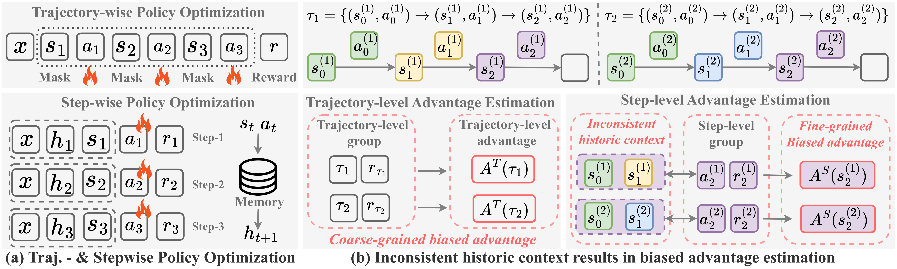
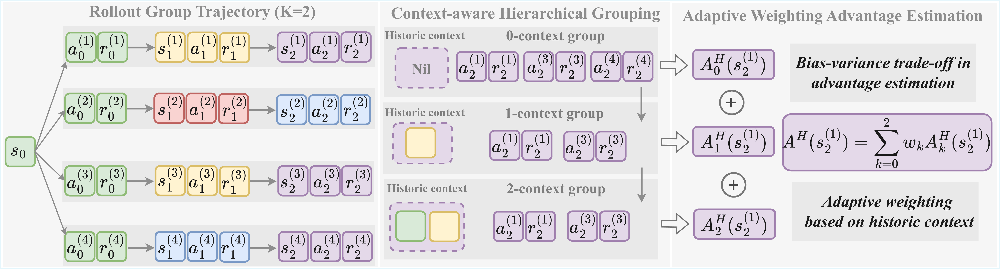

# HGPO: Hierarchy-of-Groups Policy Optimization for Long-horizon Agentic Tasks ICLR 2026

This repository provides a **HGPO (Hierarchy-of-Groups Policy Optimization for Long-horizon Agentic Tasks)** recipe for verl-agent, used for multi-turn agentic RL.



*Motivation: Figure (a) compares trajectory-wise and stepwise policy optimization frameworks. Given two example group trajectories, Figure (b) illustrates trajectory-level and step-level grouping with their corresponding advantage estimations. Best viewed in color.*



*Overview of HGPO. The LLM-based agent interacts with a set of environments initialized from the same state $\bm{s}_{0}$, producing four group trajectories (states with the same color are identical). HGPO comprises two key components: context-aware hierarchical grouping and adaptive weighted advantage computation. For illustration, consider the state $\bm{s}_{2}$ (purple). First, HGPO assigns $\bm{s}_{2}$ into three hierarchical groups according to its historical contexts. Then, it computes the final advantage estimate by adaptively aggregating the weighted advantages from these groups.*

## Scripts (examples/hgpo_trainer and recipe/hgpo)

All scripts live under `examples/hgpo_trainer/` and `recipe/hgpo/`, organized by model size and environment:

| Script | Description | Wandb logs
|--------|-------------|----------|
| `run_qwen2.5_1.5b_alfworld_train.sh` | AlfWorld training, Qwen2.5-1.5B| [](https://api.wandb.ai/links/hs827083890-nanyang-technological-university-singapore/wqg929x9)
| `run_qwen2.5_1.5b_alfworld_eval.sh` | AlfWorld evaluation, Qwen2.5-1.5B | [](https://api.wandb.ai/links/hs827083890-nanyang-technological-university-singapore/wjw9osa8)
| `run_qwen2.5_7b_alfworld_train.sh` | AlfWorld training, Qwen2.5-7B| [](https://wandb.ai/hs827083890-nanyang-technological-university-singapore/Qwen2-5_7b_Alfworld_train_open/reports/Qwen2-5_7B_Alfworld_train--VmlldzoxNTkyODEyMA)
| `run_qwen2.5_7b_alfworld_eval.sh` | AlfWorld evaluation, Qwen2.5-7B| [](https://wandb.ai/hs827083890-nanyang-technological-university-singapore/Qwen2-5_7b_Alfworld_eval_open/reports/Qwen2-5_7B_Alfworld_eval--VmlldzoxNTkyODE5Nw)
| `run_qwen2.5_1.5b_webshop_train.sh` | WebShop training, Qwen2.5-1.5B| [](https://wandb.ai/hs827083890-nanyang-technological-university-singapore/Qwen2-5_1-5b_webshop_train_open/reports/Qwen2-5_1-5B_WebShop_train--VmlldzoxNTkyNzkxNA)
| `run_qwen2.5_1.5b_webshop_eval.sh` | WebShop evaluation, Qwen2.5-1.5B| [](https://wandb.ai/hs827083890-nanyang-technological-university-singapore/Qwen2-5_1-5b_webshop_eval_open/reports/Qwen2-5_1-5b_WebShop_eval--VmlldzoxNTkyODAyMg)
| `run_qwen2.5_7b_webshop_train.sh` | WebShop training, Qwen2.5-7B| [](https://wandb.ai/hs827083890-nanyang-technological-university-singapore/Qwen2-5_7b_webshop_train_open/reports/Qwen2-5_7B_WebShop_train--VmlldzoxNTkyODE0OQ)
| `run_qwen2.5_7b_webshop_eval.sh` | WebShop evaluation, Qwen2.5-7B| [](https://wandb.ai/hs827083890-nanyang-technological-university-singapore/Qwen2-5_7b_webshop_eval_open/reports/Qwen2-5_7B_WebShop_eval--VmlldzoxNTkyODE2NQ)

- **Training scripts:** Set `history_length`, `group_size`, `mode`, `weight_type`, `length_weight_alpha`, `base_group`, etc. Experiment names are auto-generated (e.g. `k2_hgpo_length_alpha1.0_baseGroup_False`).
- **Eval scripts:** Fill in `eval_experiment_names` in the script (matching training `experiment_name`). The script parses `history_length` from the name (e.g. `k2`→2, `k4`→4), runs evaluation for each of `seeds=(123 456 789)`, and writes logs to `logs/<checkpoint_dir>/output_seed{seed}.log`.

## Environment variables

Scripts rely on the following environment variables (set as needed):

- `HF_HOME`: Hugging Face cache directory
- `WANDB_API_KEY`: WandB API key (optional)
- `WANDB_DIR`: WandB log directory (optional)
- `CUDA_VISIBLE_DEVICES`: Visible GPUs
- `CHECKPOINTS_DIR`: Checkpoint root directory; used by both training and evaluation

Example:

```bash
export HF_HOME=/path/to/hf
export WANDB_API_KEY=your_key
export WANDB_DIR=/path/to/wandb
export CUDA_VISIBLE_DEVICES=0,1,2,3
export CHECKPOINTS_DIR=/path/to/checkpoints
```

## Algorithm parameters (algorithm.hgpo)

| Parameter | Description | Typical values |
|-----------|-------------|----------------|
| `mode` | Within-group advantage normalization | `mean_norm` / `mean_std_norm` |
| `weight_type` | Within-group weight type | `length` (step-length weighting) |
| `length_weight_alpha` | Weight is L^alpha; alpha=0 is uniform | 1.0 |
| `base_group` | Use episode advantage as initial group in aggregation | true / false |

Use together with env options such as `env.history_length` and `env.rollout.n` (rollouts per group).

## Reproducing experiments

### Environment and data

- Install and configure AlfWorld / WebShop (see [agent_system/environments](../../agent_system/environments)).
- Data is used only to set batch size and format. Prepare text data and generate parquet first:

```bash
python3 -m examples.data_preprocess.prepare --mode 'text' --train_data_size 16 --val_data_size 128
```

Paths are set in the scripts via `data.train_files` / `data.val_files`; defaults are `$HOME/data/verl-agent/text/train.parquet` and `$HOME/data/verl-agent/text/test.parquet`.

### AlfWorld

**Training (1.5B, 2 GPUs):**

```bash
bash examples/hgpo_trainer/run_qwen2.5_1.5b_alfworld_train.sh
```

**Training (7B, 4 GPUs):**

```bash
bash examples/hgpo_trainer/run_qwen2.5_7b_alfworld_train.sh
```

**Evaluation:** Edit `eval_experiment_names` in the corresponding eval script (e.g. add `k2_hgpo_length_alpha1.0_baseGroup_False`), then run:

```bash
# 1.5B
bash examples/hgpo_trainer/run_qwen2.5_1.5b_alfworld_eval.sh

# 7B
bash examples/hgpo_trainer/run_qwen2.5_7b_alfworld_eval.sh
```

In AlfWorld eval scripts, `val_out` controls the validation set: `val_out=True` for in-domain, `val_out=False` for out-of-domain (some scripts use the variable name `eval_out` with the same meaning).

### WebShop

**Training:**

```bash
# 1.5B, 2 GPUs
bash examples/hgpo_trainer/run_qwen2.5_1.5b_webshop_train.sh

# 7B, 4 GPUs
bash examples/hgpo_trainer/run_qwen2.5_7b_webshop_train.sh
```

**Evaluation:** Similarly, set `eval_experiment_names` in the eval script (e.g. `k2_hgpo_length_step30_alpha1.0`), then run:

```bash
bash examples/hgpo_trainer/run_qwen2.5_1.5b_webshop_eval.sh
# or
bash examples/hgpo_trainer/run_qwen2.5_7b_webshop_eval.sh
```

## Upstream dependencies (recipe self-contained parts)

This recipe is self-contained under `recipe/hgpo/` for HGPO logic and trainer extensions when submitting to upstream verl-agent:

| File | Description |
|------|-------------|
| `hgpo/core_hgpo.py` | HGPO advantage computation (self-contained) |
| `hgpo/hgpo_ray_trainer.py` | PPO Ray trainer with HGPO support; `adjust_batch()` runs after `compute_advantage()` |

If not included upstream, you may also need:

- **`agent_system/environments/env_manager.py`**: AlfWorld branch should use `config.trainer.val_out` to select in-domain vs out-of-domain validation.


## Related links

- [verl-agent](https://github.com/langfengQ/verl-agent)
- [GiGPO paper](https://arxiv.org/abs/2505.10978)
